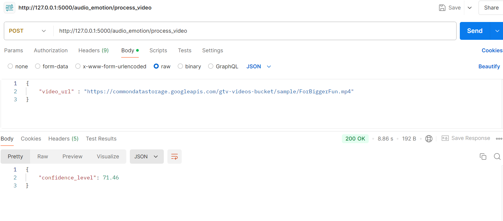

# Resume Skill Extractor and Emotion Analysis API

This project is a Flask-based API that allows users to upload their resumes and analyze their skills and emotions through various inputs, including video and audio. The API extracts skills from resumes, evaluates user emotions from video, and predicts emotions from audio.

## Features

- **Skill Extraction:** Extract skills from user-uploaded resumes.
- **Video Emotion Analysis:** Analyze emotions from video input using face detection.
- **Audio Emotion Analysis:** Analyze emotions from audio extracted from video.
- **Text Similarity Comparison:** Compare extracted text from audio with provided questions and evaluate the accuracy.

## Technologies Used

- Flask: A lightweight WSGI web application framework for Python.
- OpenCV: For video processing.
- MediaPipe: For face detection and landmark extraction.
- DeepFace: For emotion detection in facial images.
- librosa: For audio analysis and feature extraction.
- scikit-learn: For video and audio manipulation.
- SentenceTransformers: For text embedding and similarity comparison.
- pydub: For audio file manipulation.

## How It Works
- **Resume Upload and Skill Extraction:**
1. Users upload their resumes in .pdf or .docx format.
2. The application processes the text to identify and extract relevant skills using natural language processing techniques.

- **Video Upload and Emotion Analysis:**
1. The application utilizes MediaPipe to detect faces in each frame of the video.
2. The extracted face regions are analyzed using DeepFace to determine the dominant emotion for each detected face.
3. The application aggregates the emotion data over the video duration to provide an average confidence score for the detected emotions.

- **Audio Emotion Detection:**
1. The application can extract audio from the video using MoviePy and divide into chunks.
2. Each chunk is analyzed for emotional content using a pre-trained machine learning model to predict the dominant emotion present.
3. A confidence score is calculated based on the frequency of predicted emotions.

- **Text Similarity Comparison:**
1. The application extracts audio from the video, converting it to text using speech recognition.
2. The extracted text is compared against a predefined answer using Sentence Transformers to measure semantic similarity.
3. The similarity score is returned as a percentage, indicating how closely the extracted text matches the original answer.

- **Results Presentation:**
The application returns a JSON response containing the analysis results, including extracted skills, average emotional confidence scores, and text similarity percentages.

## Images

